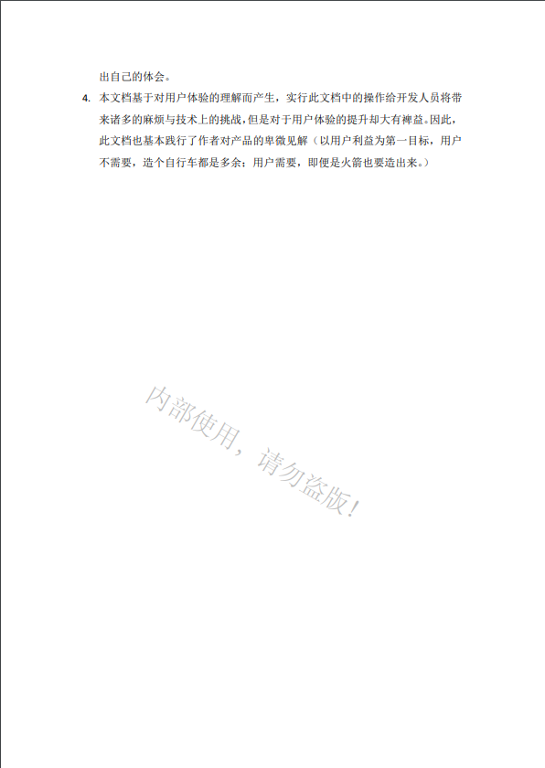

# anything-watermark
万物皆可水印。anything-watermark工具对水印进行了抽象，提取出了**位置**、**大小**、**旋转**、**透明**4个基础属性和**文字**、**图片**两个基本类型。对可添加水印的文件载体，目前抽象为了4个即图片、视频、PDF文档、WORD文档。此外，工具提供了抽象接口，可以很方便地对新的可添加水印的文件类型进行扩展。

## 在线设计水印

## 水印类型
#### 图片水印

#### PDF水印

#### 视频水印

## 水印设置项
- 类型：文字、图片
- 坐标：(x, y) 坐标值为浮点数则按照比例计算，否则按照实际像素计算
- 对齐方式：x轴始、终对齐与y轴始、终对齐，因为水印具有宽高，该参数实际用于确定水印中心点的位置
- 大小：相对其容器的大小，是一个比例值，取值区间为(0 , 1]
- 旋转角度：[0 - 360]
- 透明度：[0 - 1]
- 是否遮挡内容：设置后将有可能遮挡主体信息
- 【文字水印】文字颜色
- 【文字水印】字体样式（加粗、斜体、下划线、中划线）
- 【图片水印】图片文件

## 暂存问题
- [ ] word的水印支持不好，考虑其他解决方案
- [ ] 视频水印不支持旋转，图片水印不支持设置设置透明度
- [ ] 水印旋转时的中心点偏移问题
- [ ] pdf图片水印不支持旋转

## ChangeLog
#### v0.0.1
- [x] 支持为PDF、视频、图片、docx类型的word文档加水印
- [x] 支持大多数水印设置项（文字）
- [ ] ~~对word文档的支持较差，支持少量的配置项~~
- [ ] ~~不支持doc类型的word文档加水印操作~~